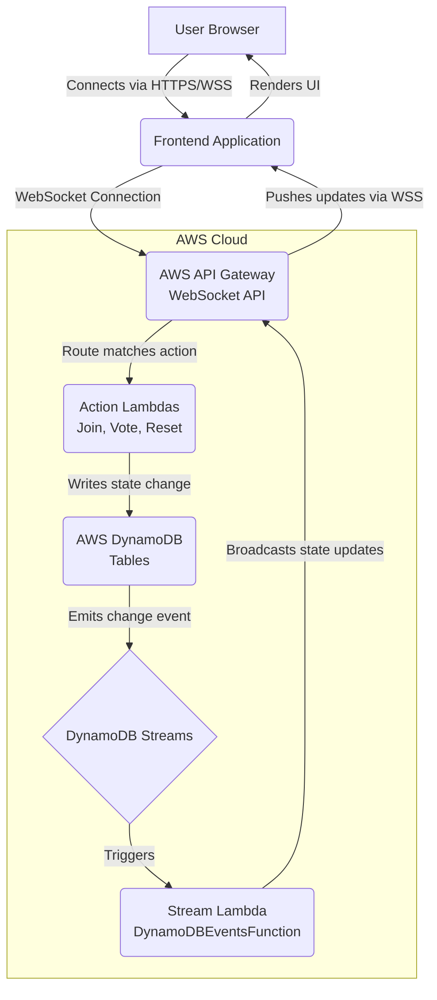

# 🃏 Planning Poker

Planning poker for relative estimating in backlog refinement meetings. This project provides a real-time, collaborative tool to facilitate agile estimation sessions.

## 🚀 Architecture Overview

This application follows a serverless architecture pattern, primarily leveraging AWS services for its backend and a modern web frontend. Communication between the frontend and backend is handled efficiently via WebSockets, enabling real-time updates for all participants.

The core components are:

*   **Frontend**: A client-side application built with Node.js/TypeScript in React, that provides the user interface for planning poker sessions. It communicates with the backend via WebSockets.
*   **API Gateway (WebSocket API)**: Acts as the entry point for WebSocket connections from the frontend. It manages connection state and routes messages to the appropriate backend Lambda functions.
*   **AWS Lambda (Action Handlers)**: Serverless functions that handle incoming WebSocket requests (e.g., joining a table, submitting a vote) and update the poker hand state in the database.
*   **AWS DynamoDB & Streams**: AWS DynamoDB stores active connections and game state. Crucially, DynamoDB Streams are enabled to capture any changes to this data.
*   **AWS Lambda (Stream Processor)**: A dedicated Lambda function (`DynamoDBEventsFunction`) listens to the DynamoDB Streams and asynchronously broadcasts the updated state back to all connected clients.

### Architecture Diagram



### Component Breakdown

*   **Frontend**: The user-facing part of the application. It's responsible for presenting the game interface, allowing users to join rooms, cast votes, and see real-time updates of the game state. It uses the `VITE_WEBSOCKET_URL` to establish a secure WebSocket connection to the backend.
*   **AWS API Gateway (WebSocket API)**: This service provides a fully managed WebSocket endpoint. It handles the complexity of maintaining persistent connections and automatically routes incoming messages to specific Lambda functions based on defined routes (e.g., `$connect`, `$disconnect`, `sendmessage`, `joinroom`).
*   **AWS Lambda**: These are event-driven, serverless compute services. Each Lambda function can be triggered by specific API Gateway routes to perform actions like initializing a new game, processing a user's vote, or sending messages to all participants in a room.
*   **AWS DynamoDB**: Provides fast and flexible NoSQL data storage. The SAM template provisions two key tables: `PlanningPokerTable` (to track active connections/users in a room) and `PlanningPokerVote` (to track individual user estimates).

## 💻 Getting Started

To get this project up and running for development, we highly recommend using a Dev Container, which sets up all necessary tools and dependencies for you.

### Prerequisites

Before you begin, ensure you have the following installed:

*   **Docker Desktop**: Required for running Dev Containers.
    *   [Download Docker Desktop](https://www.docker.com/products/docker-desktop)
*   **Visual Studio Code (VS Code)**: The recommended IDE for this project.
    *   [Download VS Code](https://code.visualstudio.com/)
*   **VS Code Dev Containers Extension**: An essential extension for opening the project in a containerized development environment.
    *   [Install Dev Containers extension](https://marketplace.visualstudio.com/items?itemName=ms-vscode-remote.remote-containers)

### Software Requirements (managed by Dev Container)

The following software will be automatically set up within your Dev Container:

*   **Node.js (v18+) & npm**: For frontend development and managing project dependencies.
*   **TypeScript**: The primary language for the project.
*   **AWS Serverless Application Model (SAM) CLI**: For building, testing, and deploying serverless applications on AWS.
*   **Google Cloud SDK / Credentials**: Configured via `GOOGLE_APPLICATION_CREDENTIALS` for potential interactions with Google Cloud Platform services during development or deployment (e.g., authentication, logging, storage).

### Local Development Setup

1.  **Clone the repository**:
    ```bash
    git clone https://github.com/Zuul86/planningpoker.git # Replace with actual repo URL
    cd planningpoker
    ```

2.  **Open in Dev Container**:
    *   Open VS Code.
    *   Go to `File > Open Folder...` and select the `planningpoker` directory.
    *   VS Code should automatically detect the `.devcontainer` folder and prompt you to "Reopen in Container". Click this button. If it doesn't prompt, open the Command Palette (`Ctrl+Shift+P` or `Cmd+Shift+P`) and type `Dev Containers: Rebuild and Reopen in Container`.

3.  **Environment Variables**:
    *   The `devcontainer.json` automatically sets `VITE_WEBSOCKET_URL` to point to the deployed backend and configures `GOOGLE_APPLICATION_CREDENTIALS`. You will need to provide your `GCP_SA_KEY` as an environment variable in your local shell *before* opening the dev container for the `postCreateCommand` to populate the `gcp-sa-key.json` file.

4.  **Install Dependencies**:
    Once inside the Dev Container, open a new terminal (`Ctrl+Shift+` ` ` ` or `Cmd+Shift+` ` ` `) and run:
    ```bash
    npm install
    ```

5.  **Run the Frontend**:
    To start the frontend development server, run (assuming a common Vite/React/etc. setup):
    ```bash
    npm run dev
    ```
    The application should now be accessible in your browser, typically at `http://localhost:3000` (or as indicated by the `npm run dev` output).

### Backend Development & Deployment

The backend is built using AWS SAM.

*   **Local Backend Invocation**: You can use the AWS SAM CLI inside the dev container to invoke Lambda functions locally for testing:
    ```bash
    sam local invoke MyLambdaFunction -e event.json
    ```
*   **Automated Deployment**: The backend infrastructure is automatically built and deployed to AWS via a GitHub Actions workflow (`.github/workflows/deploy-sam.yml`). This pipeline triggers whenever changes are pushed to the `main` branch under the `infrastructure/**` directory.
*   **Manual Deployment**: To manually deploy the backend from your local environment, ensure your AWS credentials are configured and run the following commands (mirroring the CI/CD pipeline):
    ```bash
    sam build --template-file infrastructure/template.yaml --build-in-source --cached
    sam deploy --no-confirm-changeset --no-fail-on-empty-changeset --resolve-s3 --stack-name planning-poker-stack --capabilities CAPABILITY_IAM
    ```

---
